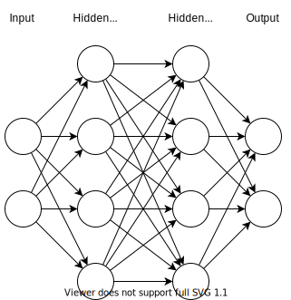
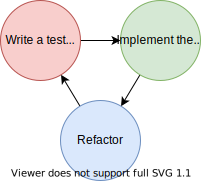
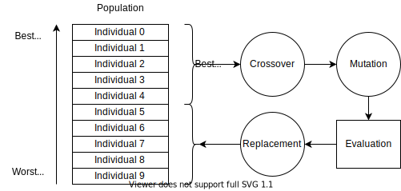

<!-- markdownlint-disable MD025 MD033 MD001 MD034-->
<!-- _class: lead -->

# <!--fit--> DeepGProp

Luis Liñán Villafranca

*Optimización de redes neuronales con algoritmos genéticos*

---

# Índice

## 1. Motivación y objetivos

## 2. Metodología

## 3. Implementación

## 4. Resultados

## 5. Conclusiones y trabajo futuro

---

<!-- _class: lead -->

# 1. Motivación y objetivos

---

#### 1. Motivación y objetivos

Bases:

- Perceptrón multicapa
- G-Prop
- Algoritmo genético

Objetivo:

- Optimizar la estructura de los perceptrones multicapa con algoritmos genéticos

<!--
Redes neuronales artificiales -> perceptrones multicapa

Múltiples métodos para optimizar algunas variables de entrada

GA para optimizar la estructura de las redes

G-Prop -> DeepGProp
-->

---

<!-- _class: lead -->

# 2. Metodología

---

#### 2. Metodología

 

Gestión del trabajo

- Kanban

Desarrollo del software

- TDD

<!--
GitHub -> Kanban -> Issues -> Milestones

TDD -> primero test y luego código

Código sencillo y con menos fallos

Permite correr test en local y en remoto (CI) (GitHub Actions)
-->

---

<!-- _class: lead -->

# 3. Implementación

---

#### 3. Implementación

Operaciones:

- Cruce
- Mutación
  - Pesos y sesgos
  - Neuronas de una capa oculta
  - Número de capas ocultas
- Reemplazo

<!--
Conseguir estructura óptima para un problema

Python

Creación de la población

Evaluación -> medidas

Bucle principal

  Cruce

  Mutaciones

  Remplazo

Métodos de parada

Cambió en la implementación de los individuos al meter modificación de
estructura.

Linux con una CPU Intel Core i7-3612QM con gráfica integrada
-->

---

<!-- _class: lead -->

# 4. Resultados

---

#### 4. Resultados - Breast Cancer Wisconsin Data Set

| Partition | Algorithm | Accuracy error% | # neurons   | F2 score        |
| --------- | --------- | --------------- | ----------- | --------------- |
| Cancer1   | G-Prop    | 1.0±0.5         | 3.2±0.8     | −−              |
|           | DeepGProp | 2.5±0.3         | 13.60±6.02  | 0.96668±0.00670 |
| Cancer2   | G-Prop    | 4.4±0.4         | 6.7±2.3     | −−              |
|           | DeepGProp | 2.3±0.0         | 10.20±4.58  | 0.97943±0.00260 |
| Cancer3   | G-Prop    | 3.0±0.7         | 4.3±1.7     | −−              |
|           | DeepGProp | 4.5±0.4         | 21.60±17.83 | 0.95952±0.00285 |

<!--
Experimentos Cancer y DNA Helicases

Media de 5 ejecuciones con diferente semilla

Resultados similares

Parámetros utilizados
-->

---

#### 4. Resultados - DNA Helicases

| Algorithm (# layers) | Gen | Acc error% | # neurons (score) | F2 score        |
| ------------------------ | --- | ---------- | ----------------- | --------------- |
| G-Prop (1)               | 10  | 6±3        | 7.3±3.9           | −−              |
| DeepGProp (1)            | 10  | 25.7±5.2   | 11.8±6.01         | 0.70976±0.07727 |
|                          | 50  | 21.0±5.0   | 15.0±4.38         | 0.72556±0.06024 |
| DeepGProp (>1)           | 50  | 18.7±2.5   | 23.8±24.3         | 0.82569±0.04718 |

<!--
Mayor complejidad

2 pruebas extra: *5 numero individuos y número de capas variable
-->

---

<!-- _class: lead -->

# 5. Conclusiones y trabajo futuro

---

#### 5. Conclusiones

 

Conclusiones:

- Ampliar el espacio de búsqueda: anchura y profundidad
- Buenos resultados en problemas pequeños
- Problemas con el dataset DNA Helicases

<!--
Más allá de G-Prop

Buenos resultados con Cancer

Mejores resultados de G-Prop - Backpropagation
-->

---

#### 5. Trabajo futuro

Hardware/Software:

- Soporte para GPU de Keras
- Paralelización de operadores genéticos

Precisión:

- Distintos algoritmos de propagación hacia atrás
- Calibrar los parámetros por defecto del algoritmo

<!--
GPU + paralelismo

Probar otros algoritmos de backpropagation

Calibración de parámetros
-->

---

<!-- _class: lead -->

## Luis Liñán Villafranca ([@lulivi](https://github.com/lulivi))

https://github.com/lulivi/deep-g-prop

